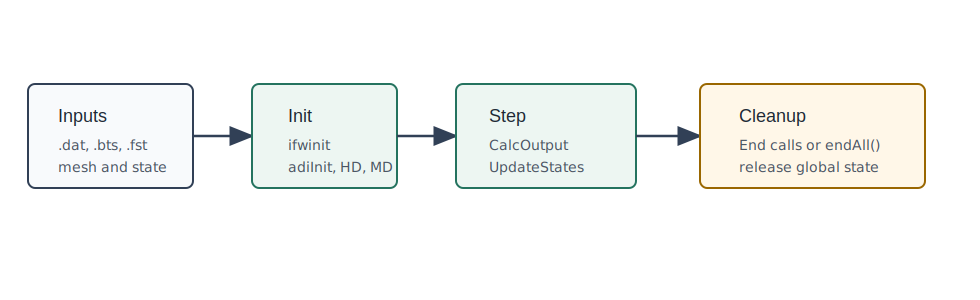

# OWENSOpenFASTWrappers.jl

OWENSOpenFASTWrappers.jl provides Julia lifecycle wrappers around the OpenFAST
libraries used by OWENS coupled simulations. The package currently covers
InflowWind, AeroDyn plus InflowWind, HydroDyn, MoorDyn, and selected OpenFAST
driver executables exposed by `OWENSOpenFAST_jll`.

Use this package when a Julia workflow needs direct OpenFAST module calls
instead of running a complete OpenFAST input deck. Each wrapped library owns
native state, so the normal workflow is:

1. Initialize the OpenFAST module with library paths, input files, mesh data,
   and time settings.
2. Pass motions or sample points into the module.
3. Calculate outputs and, for dynamic modules, advance internal states.
4. End the module before starting an independent case in the same Julia process.

## Wrapper Families

| Family | Main entry points | Typical role |
|:---|:---|:---|
| InflowWind | `ifwinit`, `ifwcalcoutput`, `ifwend`, `turbsim`, `inflowwind_driver` | Sample wind velocity at a point and time from generated InflowWind input or TurbSim data. |
| AeroDyn/InflowWind | `setupTurb`, `deformAD15`, `advanceAD15`, `endTurb`; low-level `adi*` calls | Drive AeroDyn 15 with OWENS mesh motions and return distributed loads. |
| HydroDyn | `HD_Init`, `HD_CalcOutput`, `HD_UpdateStates`, `HD_End`, `hydrodyn_driver` | Compute platform hydrodynamic loads from platform position, velocity, and acceleration. |
| MoorDyn | `MD_Init`, `MD_CalcOutput`, `MD_UpdateStates`, `MD_End`, `moordyn_driver` | Compute mooring loads and output channels from platform motion. |
| Driver executables | `turbsim`, `aerodyn_driver`, `hydrodyn_driver`, `inflowwind_driver`, `moordyn_driver` | Run OpenFAST module drivers supplied by the artifact package. |

## Documentation Map

Start with [Quickstart](@ref) for installation and the smallest test-style
calls.

Read [OpenFAST Artifacts](@ref) when the native libraries or driver executables
are not found or cannot load.

Read [Wrapper Lifecycle](@ref) before using multiple wrappers in a coupled time
loop.

Use [AeroDyn and InflowWind](@ref) and [HydroDyn and MoorDyn](@ref) for
module-specific input and update patterns.

Use [Frames, Units, and Validation](@ref) when checking signs, rotations, units,
and comparison tolerances against OpenFAST output.

Use [Developer Guide](@ref) before changing wrappers, tests, or documentation.

Use [API Reference](@ref) for generated docstrings and exact exported call
surfaces.
